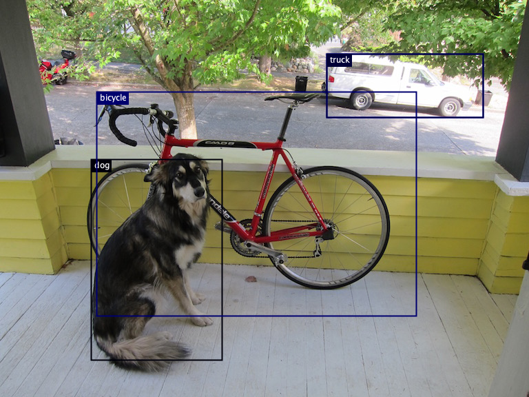

# Scala Image Recognition

## Object Detection

Based on MXNet because DJL contains a lot of embedded models for it. Finds multiple objects on image and draw rectangles
around it:



Sample output:

```
13:30:13.258 [main] INFO ObjectDetection -- dog_bike_car.jpg: [
	{"class": "dog", "probability": 0.88300, "bounds": {"x"=0.172, "y"=0.403, "width"=0.248, "height"=0.506}}
	{"class": "bicycle", "probability": 0.77266, "bounds": {"x"=0.183, "y"=0.232, "width"=0.604, "height"=0.565}}
	{"class": "car", "probability": 0.50569, "bounds": {"x"=0.618, "y"=0.137, "width"=0.296, "height"=0.160}}
	{"class": "truck", "probability": 0.33907, "bounds": {"x"=0.618, "y"=0.137, "width"=0.296, "height"=0.160}}
]
13:30:14.347 [main] INFO ObjectDetection -- Detected objects image has been saved in output/dog_bike_car-mxnet-vgg16-1708853413.png
13:30:19.630 [main] INFO ObjectDetection -- pony-toys.jpg: [
	{"class": "teddy bear", "probability": 0.44436, "bounds": {"x"=0.019, "y"=0.251, "width"=0.131, "height"=0.220}}
	{"class": "bird", "probability": 0.40916, "bounds": {"x"=0.013, "y"=0.052, "width"=0.971, "height"=0.928}}
	{"class": "cake", "probability": 0.37652, "bounds": {"x"=0.013, "y"=0.052, "width"=0.971, "height"=0.928}}
	{"class": "bird", "probability": 0.24876, "bounds": {"x"=0.698, "y"=0.316, "width"=0.286, "height"=0.319}}
	{"class": "cake", "probability": 0.24602, "bounds": {"x"=0.695, "y"=0.308, "width"=0.294, "height"=0.323}}
]
13:30:19.810 [main] INFO ObjectDetection -- Detected objects image has been saved in output/pony-toys-mxnet-vgg16-1708853419.png
13:30:24.945 [main] INFO ObjectDetection -- street.jpg: [
	{"class": "person", "probability": 0.92812, "bounds": {"x"=0.012, "y"=0.036, "width"=0.310, "height"=0.940}}
	{"class": "person", "probability": 0.85877, "bounds": {"x"=0.297, "y"=0.327, "width"=0.103, "height"=0.570}}
]
13:30:25.108 [main] INFO ObjectDetection -- Detected objects image has been saved in output/street-mxnet-vgg16-1708853424.png
```

## NSFW Detection

Based on Apache-licensed https://huggingface.co/Falconsai/nsfw_image_detection 63e0a06

Run `convert.py` to automatically download the model and convert it to TorchScript model (compatible with DJL).

Sample output:

```
13:27:05.589 [main] INFO NsfwDetection -- dog_bike_car.jpg -- nfsw: false
13:27:06.868 [main] INFO NsfwDetection -- pony-toys.jpg -- nfsw: false
13:27:07.980 [main] INFO NsfwDetection -- hentai.jpg -- nfsw: true
13:27:08.919 [main] INFO NsfwDetection -- street.jpg -- nfsw: false
13:27:09.863 [main] INFO NsfwDetection -- nudity.jpg -- nfsw: true
```


